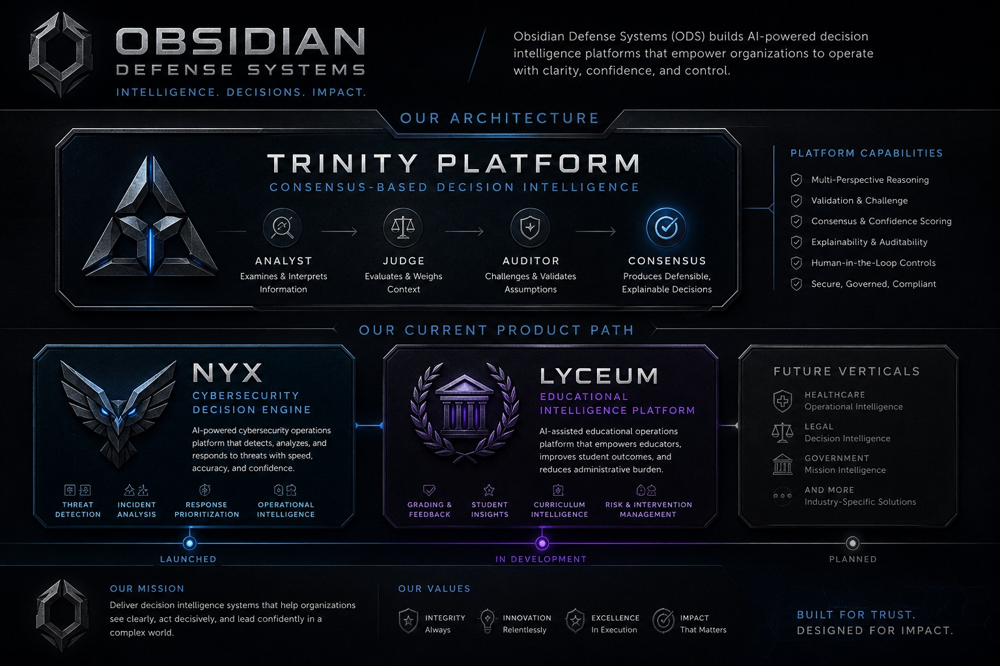

# NYX

Consensus-driven operational AI for cybersecurity decision intelligence.

---

## Overview

NYX is an AI-assisted operational intelligence platform designed to reduce alert fatigue, improve decision consistency, and accelerate cybersecurity operations through explainable consensus reasoning.

Rather than generating additional alerts, NYX focuses on transforming operational telemetry into prioritized, auditable decision workflows.

---

## The Problem

Modern security operations centers face:

- High alert volume
- Analyst fatigue
- Inconsistent triage decisions
- Fragmented operational tooling
- Limited decision auditability
- Increasing operational complexity

Organizations today increasingly face a decision scalability problem rather than a detection problem.

---

## The Solution

NYX leverages the proprietary TRINITY consensus framework:

- Analyst → Interprets telemetry and context
- Judge → Evaluates operational response
- Auditor → Challenges assumptions and validates logic
- Consensus Engine → Produces defensible decisions

This architecture is designed to preserve explainability, auditability, and human oversight while improving operational scalability.

---

## Platform Architecture

## Prototype Validation

Operational prototype testing was conducted using real enterprise alert telemetry generated from production monitoring infrastructure.

Prototype findings included:

- 2,000+ enterprise alerts processed
- ~30 days of operational telemetry analyzed
- Estimated reduction of 200+ analyst review hours
- Human review escalation preserved
- Structured audit logging generated
- Local/on-prem processing architecture validated

---

## Current Focus

- Pilot validation
- Enterprise integrations
- Human-in-the-loop workflows
- Explainable AI governance
- Air-gapped deployment models
- Operational scalability

---

## Platform Architecture

TRINITY Decision Framework:

Analyst → Judge → Auditor → Consensus

Additional ODS platform initiatives include:

- VEIL — Narrative Intelligence Platform
- LYCEUM — Educational Operational Intelligence

---

## Status

Current Stage:
Prototype / Pilot Validation

---

## Contact

Kyle Jackson

Founder | Obsidian Defense Systems

Email: kylejackson@obsidiands.com  
LinkedIn: https://www.linkedin.com/in/kyle-jackson-574a64160
 

